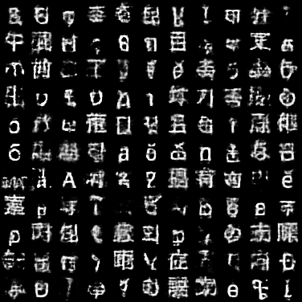

# Parametrized Universal Scripts

Parametrized Universal Scripts, or PUS, are scripts generated from VAE (variational auto-encoder) or GAN (generative adversarial network) models trained from all the scripts in the world.

See [the notebook](train_vae.ipynb) for more details.
